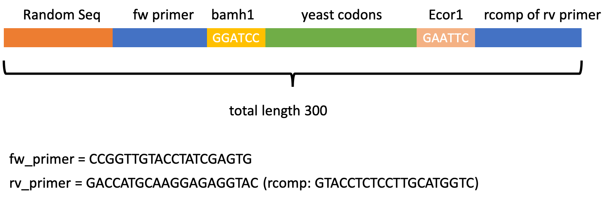
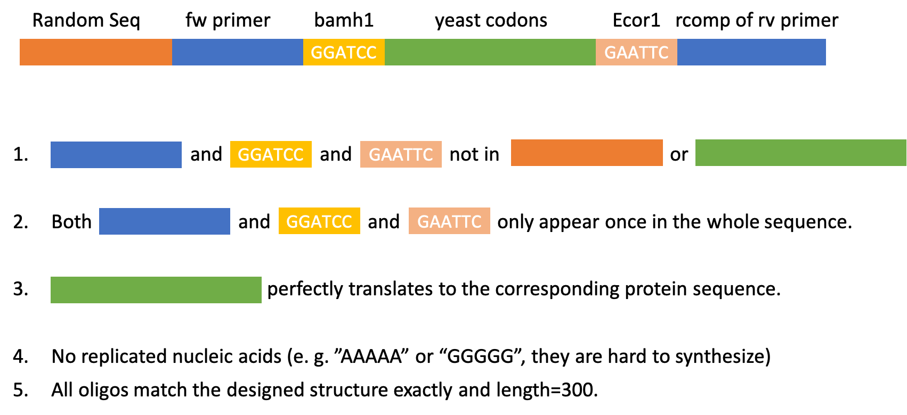

# Reverse_translation
---
> 12.2022
>
> Copyright (C) 2022 Xinran Lian
>

## Introduction
Reverse translation to design gene oligos from protein sequences used in https://www.biorxiv.org/content/10.1101/2022.12.21.521443v1

Structure of the plasmid (*PRS316*) is depicted in

* Zarrinpar, A., Park, S. H., & Lim, W. A. (2003). Optimization of specificity in a cellular protein interaction network by negative selection. Nature, 426(6967), 676-680.
https://www.nature.com/articles/nature02178

In case expresison level check is necessary, C-termial GFP fusion is not removed. This can be done by adding a stop codon before EcoR1. Complete plasmid sequence maps will be uploaded later.

We compare codon mismatches between designed proteins and their closest natural neighbor, and then mutate mismatching codons to those sampled from the multinomial distribution according to Saccharomyces cerevisiae codon usage table. Other features include:

* Fix random seeds to get constant results.
* Replace some natural codons to avoid over-similarity caused by multiple designed sequences mutated from a same one. This process can also be applied to natural sequences with minor effect. 
* Fill the oligos to uniform length of 250/300.
* Ensure there is no restriction enzyme sites in the coding region. Specially, codons of specific amino acids at both terminals were fixed.

## Required dependencies

Softwares: BLAST, MATLAB

Python modules: BioPython, numpy, scipy, pandas, matplotlib

## Getting Started

|            |                                                         |
| :---       | :---                                                    |
| Inputs/yeast_codon.xlsx      | S. cerevisiae codon usage table   |
| Inputs/Final_New_Proteins_nogap.fasta Inputs/test.fasta| Two demo fasta files |
| Inputs/twist_red_seqs_forblast.an | A local gene library as BLAST reference |
| Reverse_translation_300mer.ipynb    | Notebook for reverse translation, plase follow instruction inside  |
| local.m | See instructions in *Reverse_translation_300mer.ipynb*   |
| remove_gap_fasta.py | Script to remove gaps from input file |

## SH3 oligo specification
---
**Oligo sequence structure** (300 mer)

---
**check oligo workflow** (300 mer)
